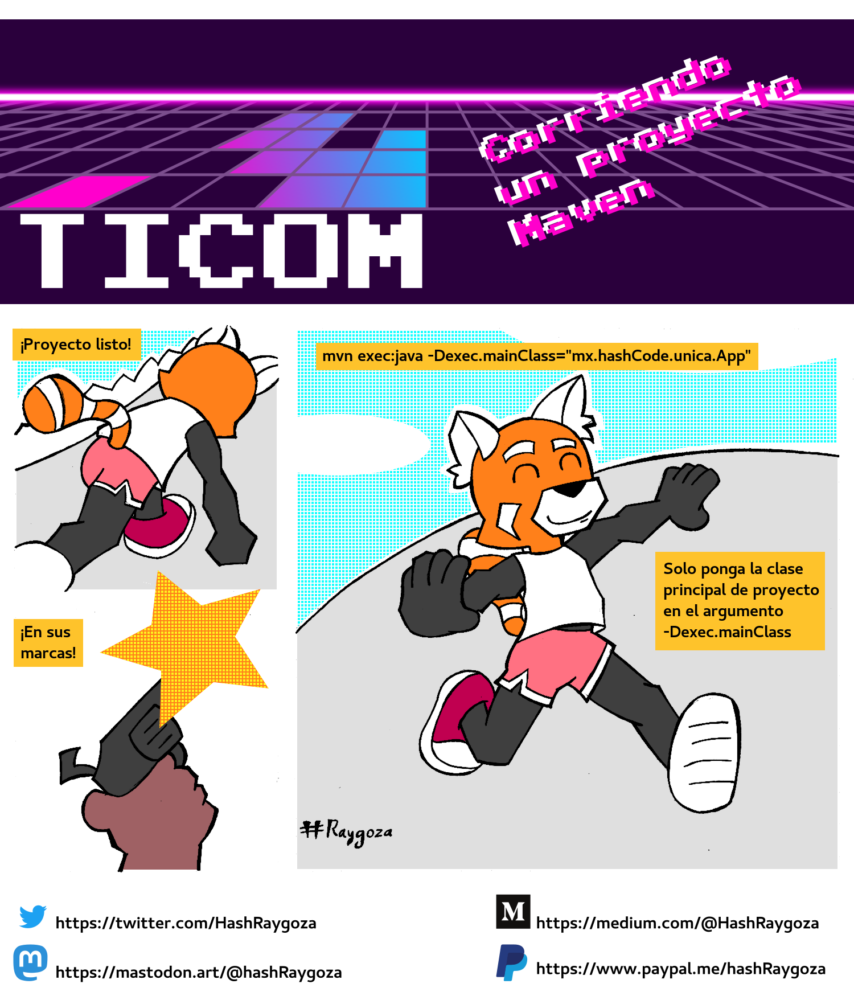

# Corriendo un proyecto Maven



¿Ya termino su proyecto en Maven y necesita correrlo desde la linea de comandos?, basta con usar

```
mvn exec:java -Dexec.mainClass="<clasePrincipal>"
```

Remplazando clasePrincipal por la ruta a la clase que contiene el método main de su aplicación.

## Transcript
Corriendo un proyecto Maven

Panel 1
Narrador: ¡Proyecto listo!

Panel 2
Narrador: ¡En sus marcas!

Panel 3
Narrador: mvn exec:java -Dexec.mainClass=”mx.hashCode.unica.App”

Narrador: Solo ponga la clase principal de proyecto en el argumento -Dexec.mainClass

